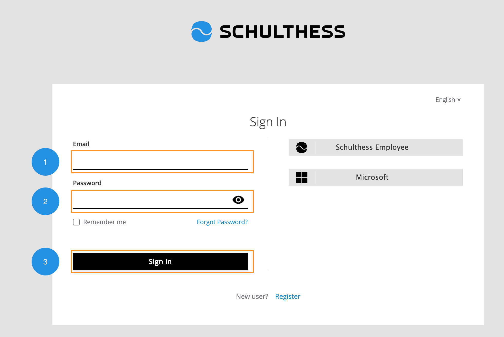
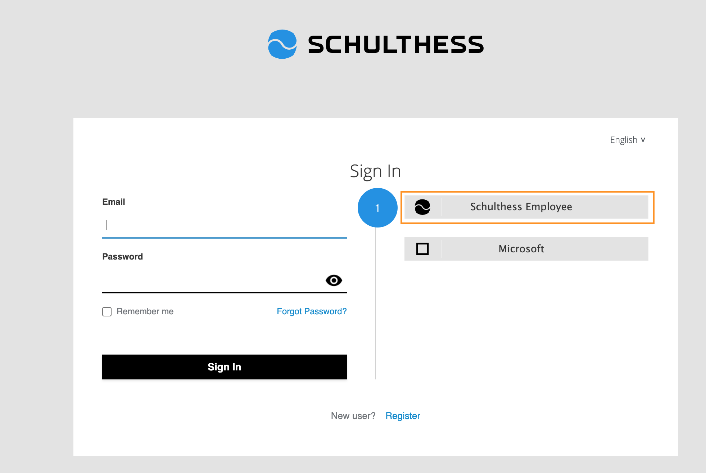
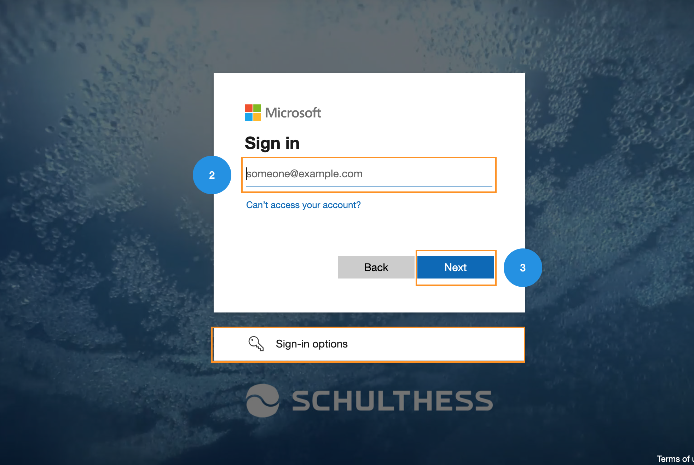
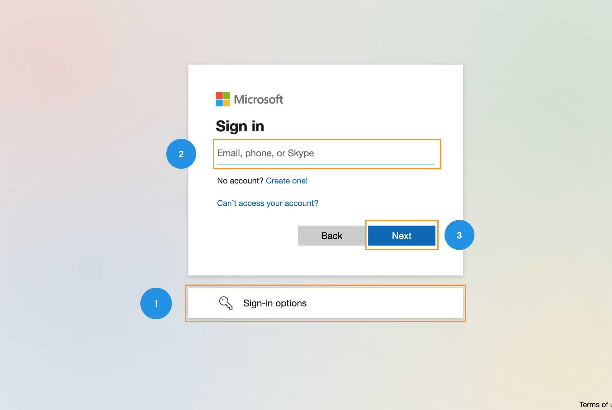
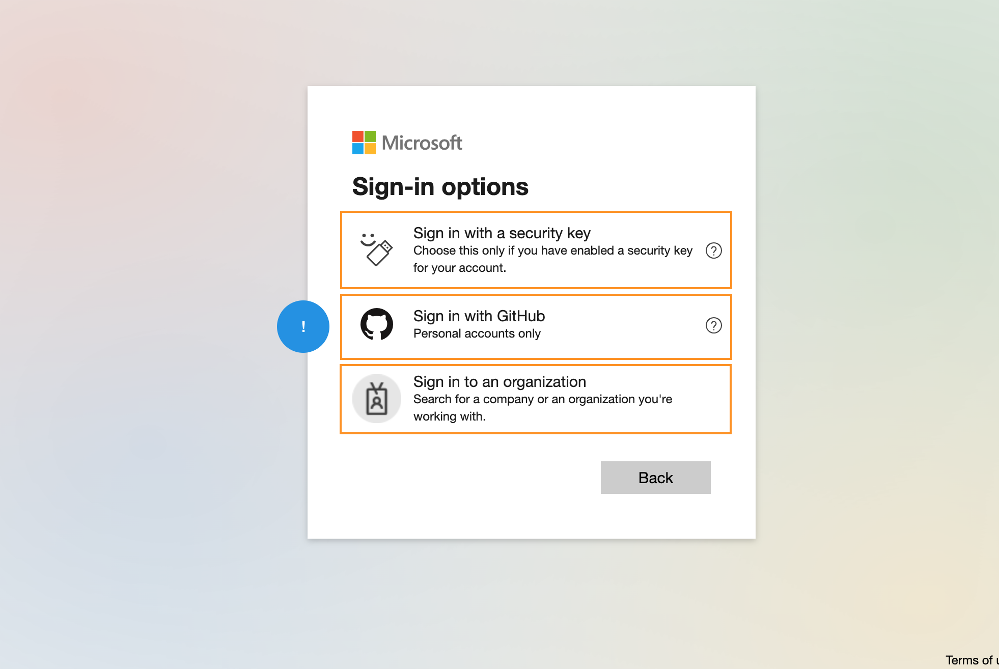

# Hoe 🔐 Inloggen bij schulthess?

---

U kunt inloggen op de Schulthess-webtoepassing met behulp van:

* **Handmatig inloggen** met uw actieve e-mailadres en wachtwoord.
* **Schulthess-medewerker** om toegang te krijgen tot uw account via het Schulthess-medewerkersportaal.
* **Microsoft** door gebruik te maken van uw Microsoft-account.

## 1️⃣ Hoe inloggen met e-mail & wachtwoord?

U kunt inloggen door deze eenvoudige stappen te volgen.

1. Voer uw **geregistreerde e-mailadres*** in.
2. Typ uw **wachtwoord** dat bij uw account hoort.
3. Klik op de knop "**Inloggen**" om in te loggen op uw account.

!!! note "Wachtwoord vergeten"
    U kunt uw wachtwoord resetten als u het bent vergeten.

!!! tip "Onthoud mij"
    U kunt uw inloggegevens opslaan voor toekomstige inlogpogingen.

## 2️⃣ Hoe inloggen met Schulthess-medewerker?

U kunt inloggen met de actieve directory van Schulthess-medewerker door deze eenvoudige stappen te volgen.

1. Klik op de optie "**Schulthess-medewerker**" op de inlogpagina.

2. U wordt doorgestuurd naar het Schulthess-medewerkersportaal.
3. Voer uw **E-mailadres** voor uw account in.
4. Klik op de knop "**Volgende**" om uw wachtwoord toe te voegen.
5. Typ uw **Wachtwoord** dat bij uw account hoort.
6. Klik op de knop "**Inloggen**" om in te loggen op uw account.

!!! note "Wachtwoord vergeten"
    U kunt uw wachtwoord resetten als u het bent vergeten.

!!! tip "Inlogopties"
    U kunt inloggen met Security Key of GitHub-account

## 3️⃣ Hoe inloggen met Microsoft?

U kunt inloggen met uw Microsoft-account door deze eenvoudige stappen te volgen.

1. Klik op de optie "**Microsoft**" op de inlogpagina.

2. U wordt doorgestuurd naar het Microsoft-inlogportaal.
3. Voer uw **E-mailadres** voor uw account in.
4. Klik op de knop "**Volgende**" om uw wachtwoord toe te voegen.
5. Typ uw **Wachtwoord** dat bij uw account hoort.
6. Klik op de knop "**Inloggen**" om in te loggen op uw account.

!!! note "Wachtwoord vergeten"
    U kunt uw wachtwoord resetten als u het bent vergeten.

!!! tip "Inlogopties"
    U kunt inloggen met Security Key, GitHub, of Organisatie account
