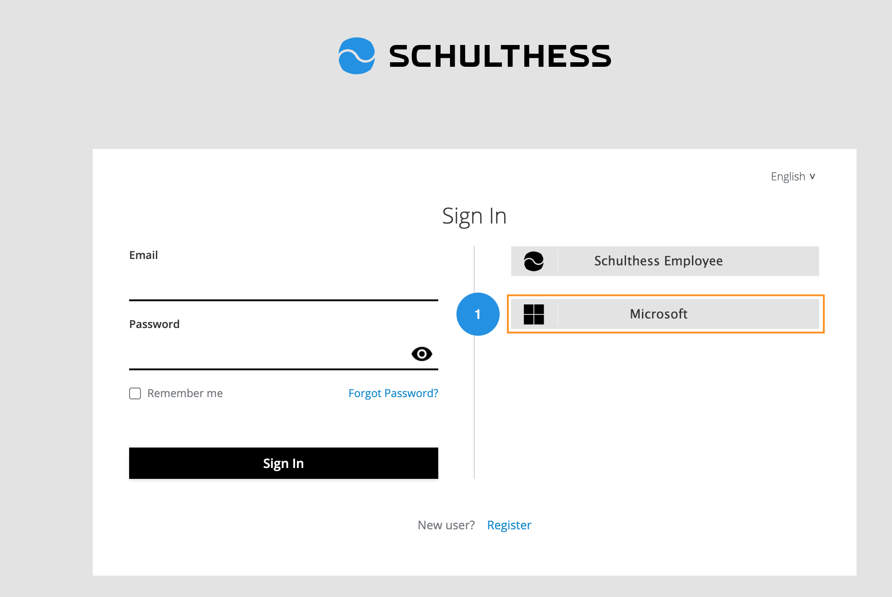
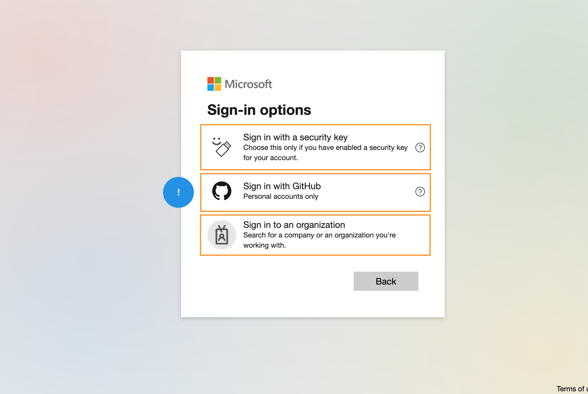

# How to 🔐 Sign In to schulthess?

---

You can Sign In to the Schulthess web application by using:

* **Manual Sign In** by using your active Email and password.
* **Schulthess Employee** to access your account by Schulthess Employee portal.
* **Microsoft** by using your Microsoft account.

## 1️⃣ How to Sign In by Email & Password?

You can Sign In by following these simple steps.

1. Enter your **registered Email**.
2. Type your **Password** related to your account.
3. Click on the "**Sign In**" button to sign in to your account.
!!! note "Forgot Password"
    **You can reset your password if you forgot it.**

!!! tip "Remember Me"
    **You can save your login details for the future login.**

## 2️⃣ How to Sign In by Schulthess Employee?

You can Sing In by using the Schulthess Employee active directory by following these simple steps.

1. Click on the "**Schulthess Employee**" option from the Sign In page.

2. You will navigate to the schulthess employee portal.
3. Enter your **Email** for your account.
4. Click on the "**Next**" button to add your password.
5. Type your **Password** related to your account.
6. Click on the "**Sign In**" button to sign in to your account.

!!! note "Forgot Password"
    **You can reset your password if you forgot it.**

!!! tip "Sign In Options"
    You can Sign In with **Security Key** or **GitHub** account

## 3️⃣ How to Sign In by Microsoft?

You can Sign In by using the Microsoft account by following these simple steps.

1. Click on the "**Microsoft**" option from the Sign In page.

2. You will navigate to the microsoft sign in portal.
3. Enter your **Email** for your account.
4. Click on the "**Next**" button to add your password.
5. Type your **Password** related to your account.
6. Click on the "**Sign In**" button to sign in to your account.

!!! note "Forgot Password"
    **You can reset your password if you forgot it.**

!!! tip "Sign In Options"
    You can Sign In with **Security Key**, **GitHub**, or **Organization** account

